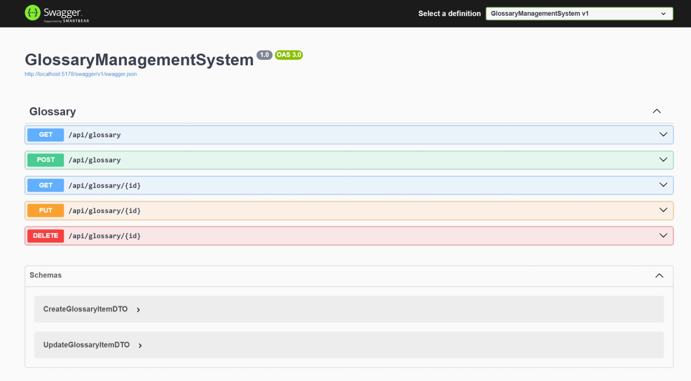

# 📚 Glossary Management System


A RESTful API for managing a glossary of terms and definitions. Built with **ASP.NET Core**, this system supports **CRUD operations**, **pagination**, and **JSON-based persistence**.

## 🚀 Features

- ✅ **Create, Read, Update, and Delete** glossary items.
- 📄 **Pagination** support for retrieving large datasets efficiently.
- 🔒 **Validation** for unique term entries.
- 💾 **JSON-based persistence** for lightweight storage (no database required).
- 🧑‍💻 Clean architecture using **DTOs**, **Repositories**, **Services**, and **Mappings**.

## 🧱 Project Structure

```bash
GlossaryManagementSystem/
├── Controllers/          # API endpoints
├── Models/               # Core domain entities (e.g., GlossaryItem)
├── DTOs/                 # Data Transfer Objects for input/output
├── Interfaces/           # Service and repository interfaces
├── Services/             # Business logic
├── Repositories/         # Data access logic
├── Data/                 # JSON file storage and context
├── Mappings/             # Mapping logic between entities and DTOs
├── Program.cs            # Application startup and DI configuration
└── README.md             # Project documentation
```

## 🛠️ Setup & Installation

### Prerequisites

- [.NET 8 SDK](https://dotnet.microsoft.com/download/dotnet/8.0) or later
- A code editor or IDE (e.g., Visual Studio, VS Code)

### Steps

1. **Clone the repository:**

   ```bash
   git clone https://github.com/your-username/GlossaryManagementSystem.git
   cd GlossaryManagementSystem
   ```

2. **Restore dependencies:**

   ```bash
   dotnet restore
   ```

3. **Run the application:**

   ```bash
   dotnet run
   ```

4. **Data Persistence:**

   - A `glossary.json` file will be created automatically in the `Data/` folder to persist glossary items.

## 🌐 API Endpoints

| Method   | Endpoint             | Description                              |
| -------- | -------------------- | ---------------------------------------- |
| `GET`    | `/api/glossary`      | Get all glossary items (with pagination) |
| `GET`    | `/api/glossary/{id}` | Get a specific item by ID                |
| `POST`   | `/api/glossary`      | Create a new glossary item               |
| `PUT`    | `/api/glossary/{id}` | Update an existing item                  |
| `DELETE` | `/api/glossary/{id}` | Delete an item by ID                     |

### ✅ Request Examples

#### Create a Glossary Item (POST)

```http
POST /api/glossary
Content-Type: application/json

{
  "term": "API",
  "definition": "Application Programming Interface"
}
```

#### Response

```json
{
  "id": 1,
  "term": "API",
  "definition": "Application Programming Interface"
}
```

### 🔍 Pagination Example

```http
GET /api/glossary?pageNumber=1&pageSize=2
```

Returns:

```json
[
  { "id": 1, "term": "API" },
  { "id": 2, "term": "REST" }
]
```

## 📦 DTOs Overview

| DTO Class                | Purpose                             |
| ------------------------ | ----------------------------------- |
| `CreateGlossaryItemDTO`  | Input for creating a new item       |
| `UpdateGlossaryItemDTO`  | Input for updating an existing item |
| `GlossaryItemDTO`        | Output for listing items            |
| `GlossaryItemDetailsDto` | Output for detailed item view       |

## 🧠 Business Logic

- **Services:** Encapsulates business logic (e.g., ensuring term uniqueness).
- **Repositories:** Handles data operations (read/write from JSON).
- **Mappings:** Extension methods for converting between entities and DTOs.

## 📂 Data Layer

- **`GlossaryDbContext`**: Manages JSON file reading/writing.
- **`glossary.json`**: Stores all glossary items in JSON format under the `Data/` folder.

## 🧪 Validation

- Prevents duplicate terms via the `Exists` method in the repository.
- Throws `400 Bad Request` if a duplicate is detected during creation.

## 📖 API Documentation

- 🐳 **Swagger UI**:
  Access the interactive API docs at:
  [http://localhost:5178/swagger](http://localhost:5178/swagger) _(or your port)_

- 📬 **Postman Collection**:
  Import our Postman collection to quickly test the API:
  👉 [Download Postman Collection](docs/GlossaryAPI.postman_collection.json)



## ⚙️ Technologies Used

- **ASP.NET Core 8**
- **C#**
- **Swagger / Swashbuckle**
- **Postman**
- **JSON File Storage**

> 🛠️ _Built with ❤️ using ASP.NET Core and C#._
